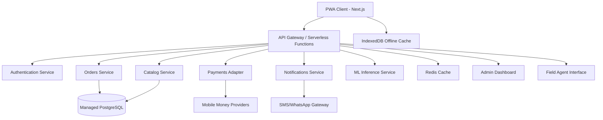

# AgroMarket AI — MVP Technical Specification

  

---

## Executive Summary

AgroMarket AI provides a comprehensive roadmap for developing our **MVP** and **MVP Lite** solutions. This document outlines our technical architecture, API specifications, and implementation strategy for creating an accessible, resilient marketplace optimized for Mozambique's agricultural sector. Our initial pilot focuses on small-scale producers, local merchants, and seamless mobile money integration.

---

## Our Vision & Mission

**Vision:** We're building an accessible, resilient marketplace for agricultural inputs and advisory services using lightweight AI, specifically designed for low-connectivity environments across Mozambique.

**MVP Success Metrics:**
- Achieve product-market fit in one pilot district with 200+ active producers within 90 days
- Process our first 100 paid orders through mobile money integration
- Demonstrate reliable last-mile delivery chains through strategic partnerships
- Capture three months of clean pricing and demand data for market insights

**MVP Lite Objectives:**
- Rapidly deploy a constrained product to validate user onboarding, catalog management, and payment systems
- Maintain manual logistics operations while minimizing automation dependencies
- Implement human-in-the-loop recommendation systems for initial launch

---

## Solution Scope: MVP vs MVP Lite

### MVP Lite (Rapid Validation Phase)
We deliver core marketplace functionality with streamlined operations:
- Phone number registration with OTP verification
- Basic producer profiles including location and crop information
- Read-only product catalog managed by administrators and vendors
- Manual order creation and status tracking
- Single mobile money provider integration
- Progressive Web App with offline catalog caching and synchronization
- Basic admin dashboard for product, order, and vendor management
- WhatsApp support channel with SMS notifications
- Minimal analytics dashboard tracking orders, users, and revenue

### Full MVP (Complete Initial Release)
Our full MVP builds upon MVP Lite with enhanced capabilities:
- Multi-vendor onboarding and catalog management
- Field agent onboarding with mobile support application
- Automated payment adapter supporting multiple local providers
- Order routing and basic logistics integration
- AI-lite features including price alerts and rule-based crop recommendations
- Background job services for notifications and data synchronization
- Redis caching for session and ephemeral data management
- Basic fraud detection and rate limiting systems

---

## Technology Architecture

Our technology stack ensures scalability, reliability, and optimal performance in low-connectivity environments:

**Frontend Development**
- **Next.js + React** PWA with offline-first design principles
- **Tailwind CSS** for consistent, responsive styling

**Backend Infrastructure**
- **Serverless functions** deployed on Vercel/AWS Lambda/Netlify
- **Managed PostgreSQL** database via Supabase/Neon/RDS
- **Redis caching** with Upstash for serverless environments
- **S3-compatible storage** for image and asset management

**Third-Party Integrations**
- **SMS/OTP services** through local providers with Twilio fallback
- **Mobile money adapters** abstracted for multiple local providers
- **ML/AI services** using rule-based engines with lightweight inference

**Monitoring & Analytics**
- **Sentry** for error tracking and performance monitoring
- **Cloud provider logs** with Prometheus integration
- Comprehensive analytics dashboard for business intelligence

---

## System Architecture



---

# API Specification

## Authentication & Authorization

All API endpoints require TLS encryption. We use JWT-based authentication with short-lived tokens obtained through phone OTP verification. Role-based access control supports `producer`, `vendor`, `admin`, and `agent` permissions.

---

## Authentication Service

### Request OTP
Initiates the authentication process by sending a one-time password to the user's mobile device.

**Endpoint:** `POST /api/auth/request-otp`

**Request:**
```json
{
  "phone": "+258XXXXXXXXX"
}
```

**Response:**
```json
{
  "session_id": "a1b2c3d4-e5f6-7890-abcd-ef1234567890",
  "ttl": 300,
  "message": "OTP sent successfully"
}
```

**Status Codes:**
- `200 OK`: OTP sent successfully
- `429 Too Many Requests`: Too many OTP requests
- `500 Internal Server Error`: SMS provider failure

---

### Verify OTP
Validates the OTP and returns authentication tokens upon successful verification.

**Endpoint:** `POST /api/auth/verify-otp`

**Request:**
```json
{
  "session_id": "a1b2c3d4-e5f6-7890-abcd-ef1234567890",
  "otp": "123456"
}
```

**Response:**
```json
{
  "token": "eyJhbGciOiJIUzI1NiIsInR5cCI6IkpXVCJ9...",
  "refresh_token": "eyJhbGciOiJIUzI1NiIsInR5cCI6IkpXVCJ9...",
  "token_expires": 3600,
  "user": {
    "id": "u1",
    "phone": "+258XXXXXXXXX",
    "role": "producer",
    "profile_complete": false
  }
}
```

**Status Codes:**
- `200 OK`: OTP verified successfully
- `401 Unauthorized`: Invalid OTP or expired session
- `404 Not Found`: Session ID not found

---

### Refresh Token
Obtains a new access token using a valid refresh token.

**Endpoint:** `POST /api/auth/refresh`

**Request:**
```json
{
  "refresh_token": "eyJhbGciOiJIUzI1NiIsInR5cCI6IkpXVCJ9..."
}
```

**Response:**
```json
{
  "token": "eyJhbGciOiJIUzI1NiIsInR5cCI6IkpXVCJ9...",
  "token_expires": 3600
}
```

**Status Codes:**
- `200 OK`: Token refreshed successfully
- `401 Unauthorized`: Invalid or expired refresh token

---

## User Management Service

### Get User Profile
Retrieves the authenticated user's profile information.

**Endpoint:** `GET /api/users/me`

**Headers:**
```
Authorization: Bearer <jwt_token>
```

**Response:**
```json
{
  "id": "u1",
  "phone": "+258XXXXXXXXX",
  "name": "Jose Silva",
  "role": "producer",
  "location": {
    "lat": -25.0,
    "lng": 32.5,
    "address": "District, Province"
  },
  "crops": ["maize", "beans"],
  "cooperative": "Local Farmers Union",
  "created_at": "2024-01-15T10:30:00Z",
  "profile_complete": true
}
```

**Status Codes:**
- `200 OK`: Profile retrieved successfully
- `401 Unauthorized`: Invalid or missing authentication token

---

### Update User Profile
Updates the authenticated user's profile information.

**Endpoint:** `PUT /api/users/me`

**Headers:**
```
Authorization: Bearer <jwt_token>
Content-Type: application/json
```

**Request:**
```json
{
  "name": "Jose Silva",
  "location": {
    "lat": -25.0,
    "lng": 32.5,
    "address": "Chokwe, Gaza"
  },
  "crops": ["maize", "beans", "vegetables"],
  "cooperative": "Chokwe Farmers Association"
}
```

**Response:**
```json
{
  "message": "Profile updated successfully",
  "user": {
    "id": "u1",
    "name": "Jose Silva",
    "location": {
      "lat": -25.0,
      "lng": 32.5,
      "address": "Chokwe, Gaza"
    },
    "crops": ["maize", "beans", "vegetables"],
    "profile_complete": true
  }
}
```

**Status Codes:**
- `200 OK`: Profile updated successfully
- `400 Bad Request`: Invalid input data
- `401 Unauthorized`: Invalid authentication token

---

### Vendor Application
Submits a vendor application with KYC documentation.

**Endpoint:** `POST /api/vendors/apply`

**Headers:**
```
Authorization: Bearer <jwt_token>
Content-Type: multipart/form-data
```

**Request Body:**
- `business_name` (string): Registered business name
- `business_type` (string): Type of business (individual, company, cooperative)
- `tax_id` (string): Business tax identification number
- `documents` (file[]): KYC documents (ID, business registration, etc.)

**Response:**
```json
{
  "application_id": "app_123456",
  "status": "under_review",
  "message": "Vendor application submitted for review",
  "estimated_review_time": "3-5 business days"
}
```

**Status Codes:**
- `202 Accepted`: Application submitted successfully
- `400 Bad Request`: Missing required documents or information
- `401 Unauthorized`: Invalid authentication token

---

## Catalog Service

### Browse Products
Retrieves a paginated list of products with search and filtering capabilities.

**Endpoint:** `GET /api/catalog`

**Query Parameters:**
- `q` (string): Search query for product names/descriptions
- `region` (string): Filter by region (e.g., "Gaza")
- `category` (string): Product category filter
- `vendor` (string): Specific vendor filter
- `page` (number): Page number for pagination (default: 1)
- `limit` (number): Items per page (default: 20, max: 50)
- `offline_hash` (string): ETag for cache validation

**Headers:**
- `If-None-Match`: ETag for conditional requests

**Response:**
```json
{
  "products": [
    {
      "id": "p1",
      "sku": "FERT-01",
      "title": "Fertilizer X",
      "description": "High-quality NPK fertilizer",
      "price": 12.5,
      "currency": "MZN",
      "unit": "kg",
      "stock": 100,
      "vendor_id": "v1",
      "vendor_name": "AgroSupplies Ltd",
      "images": ["https://.../image1.jpg"],
      "tags": ["fertilizer", "crops", "agriculture"],
      "category": "inputs",
      "region_availability": ["Gaza", "Maputo"],
      "created_at": "2024-01-15T10:30:00Z"
    }
  ],
  "pagination": {
    "page": 1,
    "limit": 20,
    "total": 150,
    "pages": 8
  },
  "etag": "a1b2c3d4e5f6",
  "last_updated": "2024-01-20T15:45:00Z"
}
```

**Status Codes:**
- `200 OK`: Products retrieved successfully
- `304 Not Modified`: Content not modified since last request
- `400 Bad Request`: Invalid query parameters

---

### Create Product
Adds a new product to the catalog (vendor/admin only).

**Endpoint:** `POST /api/catalog`

**Headers:**
```
Authorization: Bearer <jwt_token>
Content-Type: application/json
```

**Request:**
```json
{
  "sku": "FERT-01",
  "title": "Fertilizer X",
  "description": "High-quality NPK fertilizer for various crops",
  "price": 12.5,
  "currency": "MZN",
  "unit": "kg",
  "stock": 100,
  "category": "fertilizers",
  "tags": ["maize", "vegetables", "NPK"],
  "region_availability": ["Gaza", "Maputo"],
  "images": ["image1_url", "image2_url"]
}
```

**Response:**
```json
{
  "id": "p1",
  "sku": "FERT-01",
  "title": "Fertilizer X",
  "message": "Product created successfully",
  "created_at": "2024-01-20T16:30:00Z"
}
```

**Status Codes:**
- `201 Created`: Product created successfully
- `400 Bad Request`: Invalid product data
- `401 Unauthorized`: Invalid authentication token
- `403 Forbidden`: Insufficient permissions

---

### Update Product
Updates an existing product in the catalog.

**Endpoint:** `PUT /api/catalog/:id`

**Headers:**
```
Authorization: Bearer <jwt_token>
Content-Type: application/json
```

**Request:**
```json
{
  "title": "Fertilizer X - Improved Formula",
  "price": 13.0,
  "stock": 85,
  "description": "Updated formula with enhanced nutrients"
}
```

**Response:**
```json
{
  "id": "p1",
  "title": "Fertilizer X - Improved Formula",
  "message": "Product updated successfully",
  "updated_at": "2024-01-20T16:35:00Z"
}
```

**Status Codes:**
- `200 OK`: Product updated successfully
- `400 Bad Request`: Invalid update data
- `401 Unauthorized`: Invalid authentication token
- `403 Forbidden`: Insufficient permissions
- `404 Not Found`: Product not found

---

## Orders Service

### Create Order
Creates a new order and reserves inventory.

**Endpoint:** `POST /api/orders`

**Headers:**
```
Authorization: Bearer <jwt_token>
Content-Type: application/json
```

**Request:**
```json
{
  "items": [
    {
      "product_id": "p1",
      "quantity": 2,
      "unit_price": 12.5
    },
    {
      "product_id": "p2",
      "quantity": 1,
      "unit_price": 8.0
    }
  ],
  "pickup_hub_id": "hub1",
  "payment_method": "mobile_money",
  "delivery_preference": "pickup",
  "notes": "Please ensure fresh stock"
}
```

**Response:**
```json
{
  "order_id": "o1",
  "status": "created",
  "total_amount": 33.0,
  "currency": "MZN",
  "payment_required": true,
  "payment_instructions": {
    "provider": "vodamoney",
    "amount": 33.0,
    "account_number": "2588XXXXXXX"
  },
  "reserved_until": "2024-01-20T17:30:00Z",
  "created_at": "2024-01-20T16:30:00Z"
}
```

**Status Codes:**
- `201 Created`: Order created successfully
- `400 Bad Request`: Invalid order data or insufficient stock
- `401 Unauthorized`: Invalid authentication token

---

### Get Order Details
Retrieves detailed information about a specific order.

**Endpoint:** `GET /api/orders/:id`

**Headers:**
```
Authorization: Bearer <jwt_token>
```

**Response:**
```json
{
  "order_id": "o1",
  "user_id": "u1",
  "status": "paid",
  "items": [
    {
      "product_id": "p1",
      "product_name": "Fertilizer X",
      "quantity": 2,
      "unit_price": 12.5,
      "total_price": 25.0
    }
  ],
  "total_amount": 33.0,
  "currency": "MZN",
  "pickup_hub": {
    "id": "hub1",
    "name": "Chokwe Collection Point",
    "location": {
      "lat": -25.0,
      "lng": 32.5,
      "address": "Chokwe Center"
    }
  },
  "payment_status": "completed",
  "status_history": [
    {
      "status": "created",
      "timestamp": "2024-01-20T16:30:00Z"
    },
    {
      "status": "paid",
      "timestamp": "2024-01-20T16:35:00Z"
    }
  ],
  "created_at": "2024-01-20T16:30:00Z",
  "updated_at": "2024-01-20T16:35:00Z"
}
```

**Status Codes:**
- `200 OK`: Order details retrieved successfully
- `401 Unauthorized`: Invalid authentication token
- `403 Forbidden`: Order does not belong to user
- `404 Not Found`: Order not found

---

### Cancel Order
Cancels an existing order (owner/admin only).

**Endpoint:** `POST /api/orders/:id/cancel`

**Headers:**
```
Authorization: Bearer <jwt_token>
Content-Type: application/json
```

**Request:**
```json
{
  "reason": "Changed my mind",
  "refund_requested": true
}
```

**Response:**
```json
{
  "order_id": "o1",
  "status": "cancelled",
  "message": "Order cancelled successfully",
  "refund_initiated": true,
  "cancelled_at": "2024-01-20T16:40:00Z"
}
```

**Status Codes:**
- `200 OK`: Order cancelled successfully
- `400 Bad Request`: Order cannot be cancelled (e.g., already shipped)
- `401 Unauthorized`: Invalid authentication token
- `403 Forbidden`: Insufficient permissions
- `404 Not Found`: Order not found

---

## Payments Service

### Initiate Payment
Starts the payment process for an order.

**Endpoint:** `POST /api/payments/initiate`

**Headers:**
```
Authorization: Bearer <jwt_token>
Content-Type: application/json
```

**Request:**
```json
{
  "order_id": "o1",
  "provider": "vodamoney",
  "amount": 100.50,
  "phone": "+258XXXXXXXX",
  "currency": "MZN"
}
```

**Response:**
```json
{
  "payment_id": "p1",
  "status": "pending",
  "provider": "vodamoney",
  "amount": 100.50,
  "currency": "MZN",
  "instructions": {
    "step1": "Dial *111# on your mobile",
    "step2": "Select 'Send Money'",
    "step3": "Enter agent number 2588XXXXXXX",
    "step4": "Enter amount 100.50 MZN",
    "step5": "Confirm transaction"
  },
  "expires_at": "2024-01-20T17:30:00Z",
  "created_at": "2024-01-20T16:30:00Z"
}
```

**Status Codes:**
- `200 OK`: Payment initiated successfully
- `400 Bad Request`: Invalid payment request
- `401 Unauthorized`: Invalid authentication token
- `404 Not Found`: Order not found

---

### Payment Webhook
Receives payment notifications from payment providers (public endpoint).

**Endpoint:** `POST /api/payments/webhook`

**Headers:**
```
X-Signature: <provider_signature>
Content-Type: application/json
```

**Request:**
```json
{
  "payment_id": "p1",
  "status": "success",
  "provider_ref": "txn_abc123",
  "amount": 100.50,
  "currency": "MZN",
  "timestamp": "2024-01-20T16:35:00Z",
  "metadata": {
    "customer_phone": "+258XXXXXXXX",
    "transaction_id": "MPESA123456"
  }
}
```

**Response:**
```json
{
  "status": "acknowledged",
  "processed": true,
  "order_updated": true
}
```

**Status Codes:**
- `200 OK`: Webhook processed successfully
- `400 Bad Request`: Invalid webhook data
- `401 Unauthorized`: Invalid signature

---

## Notifications Service

### Send Notification
Internal service for sending notifications to users.

**Endpoint:** `POST /api/notify`

**Headers:**
```
Authorization: Bearer <service_token>
Content-Type: application/json
```

**Request:**
```json
{
  "type": "order_update",
  "to": "+258XXXXXXXX",
  "channel": ["sms", "whatsapp"],
  "payload": {
    "order_id": "o1",
    "status": "shipped",
    "estimated_delivery": "2024-01-21",
    "tracking_url": "https://agromarket.ai/track/o1"
  },
  "language": "pt",
  "priority": "high"
}
```

**Response:**
```json
{
  "notification_id": "n1",
  "status": "queued",
  "channels_sent": ["sms", "whatsapp"],
  "estimated_delivery": "2-5 minutes"
}
```

**Status Codes:**
- `202 Accepted`: Notification queued successfully
- `400 Bad Request`: Invalid notification data
- `401 Unauthorized`: Invalid service token

---

## AI & Analytics Service

### Price Alerts
Retrieves price intelligence and market alerts for specific crops and regions.

**Endpoint:** `GET /api/price/alerts`

**Query Parameters:**
- `crop` (string, required): Crop type (e.g., "maize")
- `region` (string, required): Target region (e.g., "Gaza")
- `period` (string): Analysis period (e.g., "30d", "90d")

**Headers:**
```
Authorization: Bearer <jwt_token>
```

**Response:**
```json
{
  "crop": "maize",
  "region": "Gaza",
  "current_price": 12.3,
  "currency": "MZN",
  "unit": "kg",
  "analysis_period": "30d",
  "moving_average_30d": 11.8,
  "price_trend": "up",
  "trend_strength": "moderate",
  "alerts": [
    {
      "type": "price_increase",
      "severity": "medium",
      "message": "Price increased by 4.2% over 30-day average",
      "recommendation": "Consider purchasing soon as prices are trending upward"
    }
  ],
  "market_insights": [
    "High demand reported in neighboring districts",
    "Supply expected to improve in next 2 weeks"
  ],
  "last_updated": "2024-01-20T15:00:00Z"
}
```

**Status Codes:**
- `200 OK`: Price data retrieved successfully
- `400 Bad Request`: Missing required parameters
- `401 Unauthorized`: Invalid authentication token

---

### Crop Recommendations
Provides personalized product recommendations based on crop and growing conditions.

**Endpoint:** `POST /api/recommendation/crop`

**Headers:**
```
Authorization: Bearer <jwt_token>
Content-Type: application/json
```

**Request:**
```json
{
  "crop": "maize",
  "soil_type": "sandy",
  "growth_stage": "pre-plant",
  "region": "Gaza",
  "farm_size": 2.5,
  "previous_yield": 1.8,
  "budget_constraints": "medium"
}
```

**Response:**
```json
{
  "crop": "maize",
  "region": "Gaza",
  "recommendations": [
    {
      "product_id": "p1",
      "product_name": "Fertilizer X",
      "recommendation_type": "essential",
      "reason": "NPK composition matches sandy soil requirements for maize",
      "application_timing": "pre-planting",
      "dosage": "100kg per hectare",
      "expected_impact": "15-20% yield improvement",
      "cost_benefit": "high",
      "vendor_info": {
        "vendor_id": "v1",
        "vendor_name": "AgroSupplies Ltd",
        "price": 12.5,
        "availability": "in_stock"
      }
    },
    {
      "product_id": "p2",
      "product_name": "Soil Conditioner Y",
      "recommendation_type": "supplementary",
      "reason": "Improves water retention in sandy soils",
      "application_timing": "pre-planting",
      "dosage": "50kg per hectare",
      "expected_impact": "Better drought resistance",
      "cost_benefit": "medium",
      "vendor_info": {
        "vendor_id": "v2",
        "vendor_name": "SoilCare Solutions",
        "price": 8.0,
        "availability": "in_stock"
      }
    }
  ],
  "total_estimated_cost": 345.0,
  "currency": "MZN",
  "estimated_yield_improvement": "18%",
  "generated_at": "2024-01-20T16:30:00Z"
}
```

**Status Codes:**
- `200 OK`: Recommendations generated successfully
- `400 Bad Request`: Invalid input data
- `401 Unauthorized`: Invalid authentication token

---

## Error Responses

All endpoints may return standardized error responses:

```json
{
  "error": {
    "code": "invalid_otp",
    "message": "The provided OTP is invalid or has expired",
    "details": {
      "retry_attempts_remaining": 2,
      "cooldown_period": 300
    },
    "timestamp": "2024-01-20T16:30:00Z",
    "request_id": "req_123456"
  }
}
```

**Common Error Codes:**
- `invalid_otp`: OTP verification failed
- `insufficient_permissions`: User lacks required permissions
- `insufficient_stock`: Product inventory insufficient
- `payment_failed`: Payment processing failed
- `service_unavailable`: External service temporarily unavailable

---

## Rate Limiting

API rate limits are applied per user and endpoint:

- **Authentication endpoints**: 5 requests per minute
- **Product catalog**: 60 requests per minute
- **Order management**: 30 requests per minute
- **Payment processing**: 10 requests per minute

Rate limit headers are included in all responses:
```
X-RateLimit-Limit: 60
X-RateLimit-Remaining: 45
X-RateLimit-Reset: 1642683600
```
---

## Data Architecture

**User Profiles**
- UUID identification with phone-based authentication
- Geographic location data with crop specialization
- Role-based access controls and preferences

**Product Catalog**
- SKU-based inventory management with variant support
- Multi-vendor product relationships and availability tracking
- Rich metadata including images, tags, and pricing history

**Order Management**
- Complete order lifecycle tracking from creation to delivery
- Payment transaction references and status history
- Hub-based pickup location management

**Logistics Framework**
- Hub capacity planning and geographic distribution
- Field agent assignments and delivery confirmation
- Inventory management and stock level monitoring

---

## Offline-First Strategy

We prioritize accessibility in low-connectivity environments through:

**Progressive Web App Capabilities**
- Service worker implementation for essential asset caching
- IndexedDB storage for catalog data and draft orders
- Background synchronization when connectivity resumes

**Bandwidth Optimization**
- ETag implementation for efficient data transfer
- Gzip compression for all API responses
- Lazy loading of non-essential images and assets

**Alternative Access Methods**
- USSD/SMS workflows for basic operations
- Order status checking via simple code-based queries
- Fallback communication channels for critical notifications

---

## Security & Compliance

**Data Protection**
- End-to-end TLS encryption for all data transmissions
- Database encryption at rest with regular security audits
- Minimal PII storage with anonymized analytics data

**Authentication Security**
- Short-lived OTP sessions with configurable expiration
- JWT token rotation with secure refresh mechanisms
- Rate limiting and brute force protection

**Regulatory Compliance**
- Localized consent forms in Portuguese during registration
- LGPD-compliant data processing and storage practices
- Comprehensive audit logging for compliance reporting

---

## Success Measurement

We track our progress through key performance indicators:

**User Engagement**
- Active producer registration and retention rates
- Weekly order volume and transaction frequency
- 30-day user retention and platform engagement

**Business Metrics**
- Payment success rates and transaction completion
- Order-to-delivery time efficiency
- Average transaction value and revenue growth

**Platform Performance**
- System uptime and reliability metrics
- API response times and error rates
- Offline capability utilization and sync success

---

## Partnership Strategy

Our go-to-market approach leverages strategic collaborations:

**Local Ecosystem Integration**
- Cooperative partnerships for producer onboarding
- Logistics provider integration for last-mile delivery
- Mobile money provider relationships for payment processing

**Government & Community Engagement**
- Ministry of Agriculture collaboration for credibility
- Extension agent networks for field support
- Community-based organizations for local trust building

**Technology Partnerships**
- Local SMS gateway providers for cost optimization
- Cloud infrastructure partners for scalable deployment
- Monitoring and analytics services for performance insights

---

## Deployment Framework

**Development Workflow**
- Monorepo architecture with frontend and functions workspaces
- Continuous integration with automated testing and quality checks
- Feature flag implementation for controlled pilot releases

**Infrastructure Management**
- Serverless function deployment across multiple providers
- Database management with automated backups and scaling
- Cache layer configuration for optimal performance

**Release Strategy**
- Staged rollout with pilot district focus
- Performance monitoring and real-time analytics
- Rapid iteration based on user feedback and metrics

---

## Next Steps & Implementation Timeline

Our immediate priorities focus on rapid validation and iteration:

**Phase 1: Foundation (Weeks 1-4)**
- Establish local partnerships with cooperatives and logistics providers
- Initialize monorepo structure with Next.js PWA scaffold
- Implement core OTP authentication and catalog management

**Phase 2: MVP Lite (Weeks 5-8)**
- Deploy basic order management without payment integration
- Onboard initial pilot users and collect feedback
- Finalize mobile money provider contract negotiations

**Phase 3: Full MVP (Weeks 9-12)**
- Integrate payment processing and complete order lifecycle
- Launch field agent tools and vendor onboarding
- Begin data collection for AI feature development

---

## Contact & Ownership

**Technical Leadership:** AgroMarket AI Engineering Team  
**Documentation Updates:** We welcome contributions through pull requests and issue tracking in our repository  
**Pilot Program Coordination:** Direct inquiries to our partnerships team

*This document represents our current technical direction and may evolve based on pilot learnings and user feedback.*
